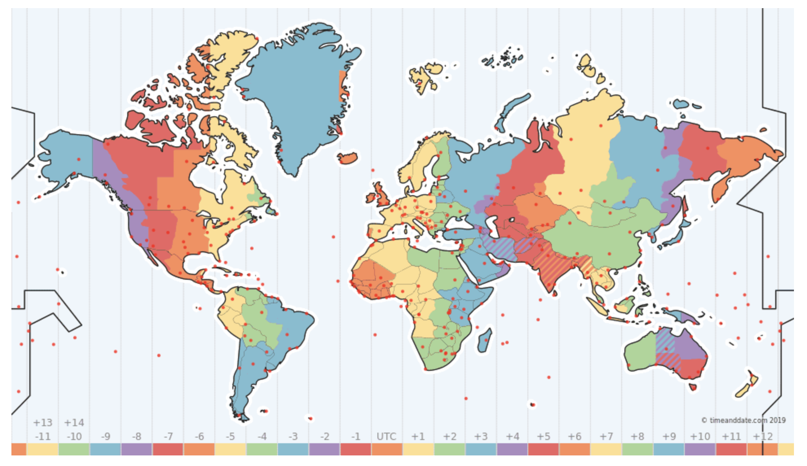

# Deploy eosio.contracts v1.7.1 - Producers Location Patch

## Requirements

- [eosio.cdt 1.6.3](https://github.com/EOSIO/eosio.cdt/tree/v1.6.3)
- [eosio 1.8.6](https://github.com/EOSIO/eos/tree/v1.8.6)
- [eosio.contracts v1.7.1-location](https://github.com/eosrio/eosio.contracts/tree/eos-mainnet/v1.7.1-location)


### 1. Patch applied:

```
@@ -79,7 +79,9 @@ namespace eosiosystem {

       auto idx = _producers.get_index<"prototalvote"_n>();

-      std::vector< std::pair<eosio::producer_key,uint16_t> > top_producers;
+      using value_type = std::pair<eosio::producer_key,uint16_t>;
+
+      std::vector< value_type > top_producers;
       top_producers.reserve(21);

       for ( auto it = idx.cbegin(); it != idx.cend() && top_producers.size() < 21 && 0 < it->total_votes && it->active(); ++it ) {
@@ -90,8 +92,10 @@ namespace eosiosystem {
          return;
       }

-      /// sort by producer name
-      std::sort( top_producers.begin(), top_producers.end() );
+       std::sort( top_producers.begin(), top_producers.end(), []( const value_type& lhs, const value_type& rhs ) {
+           //return lhs.first.producer_name < rhs.first.producer_name; // sort by producer name
+           return lhs.second < rhs.second; // sort by location
+       } );

       std::vector<eosio::producer_key> producers;
```


### 2. Build and verify checksums:

#### Build:

- Clone branch [eos-mainnet/v1.7.1-location](https://github.com/eosrio/eosio.contracts/tree/eos-mainnet/v1.7.1-location)
- Build

```
./build.sh -c [eosio.cdt Path] -e [eosio Path]
```

#### Verify checksums:

This proposal only affects the code file. There is no need to updtade the abi.

You can check the checksums, running the following command:

##### Current Mainnet eosio.system contract:

```
cleos -u http://api.eosrio.io get code eosio
code hash: 612b7eb30654473e6b943e58d49c0393eea619d7e53dbc8a166f484546ed02cc

```

##### eosio.system contract patched:

```
openssl dgst -sha256 eosio.system/eosio.system.wasm
SHA256(eosio.system.wasm)= df5aa4c8295011e055baa631045844b1363cb7c15b5a4804756f7b24b4280143
```

### 2. Review our proposal

```
cleos -u http://api.eosrio.io multisig review eosriobrazil prodlocation
```

***Before approve the multisig, please update your location:***

```
cleos -u http://api.eosrio.io system regproducer {producer_name} {prodcer_key} {url} {location}
```
Where the location is the producer timezone. Please refer to the map below to check your timezone, remember to not use a negative timezone.



E.g.:
EOSRio (Rio de Janeiro) is UTC-3. In this case, will be 21.
```
cleos -u http://api.eosrio.io  system regproducer eosriobrazil EOS1234567890XXXXXXXXXXXXXXXXXXXXXXXXXXXXXXXXXXXXXXXX eosrio.io 21
```

Made with ♥ by [EOS Rio](https://eosrio.io/)
